 

## About

I build end-to-end analytics systems — from raw transactional or sensor data through to a dashboard someone actually uses to make a decision — and I've deliberately spread that practice across retail, finance, healthcare, logistics, and education so I understand how the same core techniques (segmentation, cohort analysis, risk modeling, forecasting) change shape depending on the domain.

Looking for **Data Analyst**, **BI Developer**, or **Analytics Engineer** roles.

 

## 🛍️ Retail & Consumer

<table>
<tr>
<td width="50%" valign="top">

**Consumer360**
RFM segmentation, cohort retention, market basket rules, and CLV modeling over retail transactions.

  

</td>
<td width="50%" valign="top">

**RevenuePulse**
E-commerce sales & customer analytics dashboard over 500,000+ transactions.

  

</td>
</tr>
</table>

## 💰 Finance & Risk

<table>
<tr>
<td width="50%" valign="top">

**AlphaPulse**
Financial analytics & risk-intelligence platform — 10k+ path Monte Carlo simulation, VaR, Expected Shortfall.

  

</td>
<td width="50%" valign="top">

**Portfolio Optimization**
Efficient frontier construction, Monte Carlo simulation, Sharpe-ratio-based allocation.

  

</td>
</tr>
</table>

## 🏥 Healthcare & Education

<table>
<tr>
<td width="50%" valign="top">

**MediFlow Cloud** — *in progress*
Readmission-risk and bed-utilization analytics over a simulated ~2 TB dataset, S3 → Athena → BI pipeline.

</td>
<td width="50%" valign="top">

**EduVista**
Face recognition + RFID attendance system with anomaly detection.

  

</td>
</tr>
</table>

## 🚚 Supply Chain & Restaurants

<table>
<tr>
<td width="33%" valign="top">

**LogiScale BigData** — *in progress*
Demand & route intelligence over PySpark-processed Parquet data, Streamlit layer with Gemini API integration.

</td>
<td width="33%" valign="top">

**ZomatoLens**
Sentiment and geospatial analysis of restaurant trends across India.

  

</td>
<td width="33%" valign="top">

**Fuel Economy Modeling**
EDA, clustering, and regression on EPA fuel-efficiency data.

  

</td>
</tr>
</table>

> Consumer360, MediFlow, and LogiScale each have their own README with the full breakdown — this page is the map, not the whole territory.

 

## Stack

Python · SQL · MySQL · SQLite · MongoDB · AWS (S3, Athena) · PySpark / Spark SQL

 

Reach out via <a href="https://www.linkedin.com/in/riddhima-singh-a7383431a">LinkedIn</a> or <a href="mailto:rsm130205@gmail.com">email</a> — always happy to talk about any of these projects in more depth.

