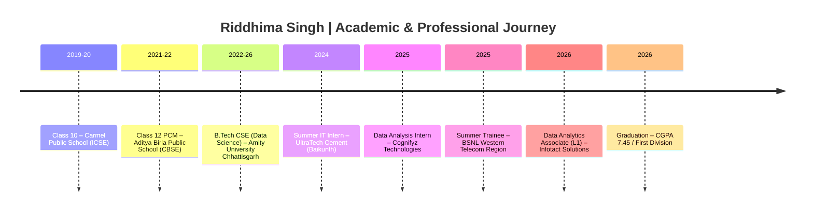

**📍 Raipur, Chhattisgarh, India** · **B.Tech CSE (Data Science) · Amity University** · **CGPA 7.45** · **2026 Graduate**

 

---

## Executive Metrics

---

## Capability Matrix

| Domain | Maturity | Focus |
|:-------|:--------:|:------|
| Retail Analytics | ██████████ | RFM · CLV · Cohort · Basket |
| Financial & Risk | ██████████ | VaR · Monte Carlo · Sharpe |
| Healthcare Analytics | ████████░░ | Readmission · Utilization |
| Supply Chain | ████████░░ | Demand · Route Optimization |
| Cloud Analytics | ███████░░░ | AWS S3 · Athena · QuickSight |
| Big Data Engineering | ███████░░░ | PySpark · Distributed Processing |

---

## Project Gallery

---

## Featured Projects

### 🛍️ Consumer360 — Retail Customer Intelligence

| | |
|:--|:--|
| **Problem** | Fragmented transactions → untargeted marketing |
| **Analytics** | RFM Segmentation · Cohort · Market Basket · CLV |
| **Stack** | Python · SQL · Power BI |
| **Status** | Completed |
| **Repo** | [Consumer-360](https://github.com/Riddhis2226/Consumer-360) |

---

### 💰 AlphaPulse — Portfolio Risk Platform

| | |
|:--|:--|
| **Problem** | Missing institutional-grade risk visibility |
| **Analytics** | 10k+ Monte Carlo · VaR · Expected Shortfall |
| **Stack** | Python · MongoDB · Streamlit · Plotly |
| **Status** | Completed |
| **Repo** | [AlphaPulse](https://github.com/Riddhis2226/AlphaPulse-Portfolio-Risk-Monitor) |

---

### 🎓 EduVista — AI + IoT Attendance

| | |
|:--|:--|
| **Problem** | Manual, error-prone attendance processes |
| **Analytics** | Face Recognition + RFID · Anomaly Detection |
| **Stack** | Python · Luxand API · RFID · IoT |
| **Status** | Completed · [Live](https://edu-vista-attendance.lovable.app/) |
| **Repo** | [EduVista](https://github.com/Riddhis2226/Edu-Vista-Attendance) |

---

### 🍽️ ZomatoLens — Restaurant Intelligence

| | |
|:--|:--|
| **Problem** | Fragmented restaurant trend data across India |
| **Analytics** | NLP Sentiment · Geospatial Intelligence |
| **Stack** | Python · Streamlit · Plotly · NLP |
| **Status** | Completed |
| **Repo** | [ZomatoLens](https://github.com/Riddhis2226/ZomatoLens-A-Data-Driven-Exploration-of-Restaurant-Trends-in-India) |

---

### 💹 Portfolio Optimization · Quant Finance

| | |
|:--|:--|
| **Problem** | Manual risk-return allocation inefficiency |
| **Analytics** | Efficient Frontier · Monte Carlo · Sharpe |
| **Stack** | Python · SQLite · Power BI |
| **Status** | Completed |
| **Repo** | [Portfolio Optimization](https://github.com/Riddhis2226/Financial-Portfolio-Optimization-System) |

---

### ⛽ Fuel Economy Modeling · Predictive Analytics

| | |
|:--|:--|
| **Problem** | Unclear drivers of vehicle fuel efficiency |
| **Analytics** | EDA · Clustering · Classification · Regression |
| **Stack** | Python · Scikit-Learn |
| **Status** | Completed |
| **Repo** | [Fuel Economy](https://github.com/Riddhis2226/Fuel-Ecomony-Analysis-and-Predictive-Modeling) |

---

## Enterprise Builds

### 🏥 MediFlow Cloud — Healthcare Analytics

| | |
|:--|:--|
| **Problem** | High latency & limited visibility into readmission risk and bed utilization |
| **Architecture** | AWS S3 Data Lake → Athena → QuickSight / Power BI |
| **Stack** | AWS S3 · Athena · PySpark · SQL · Power BI · QuickSight |
| **Status** | In Progress |
| **Value** | Query latency 45 min → <90 sec on ~2 TB simulated data |

---

### 🚚 LogiScale BigData — Supply Chain Platform

| | |
|:--|:--|
| **Problem** | Need for scalable demand forecasting and route intelligence |
| **Architecture** | PySpark → Spark SQL / Parquet → Streamlit + Plotly |
| **Stack** | PySpark · Spark SQL · Parquet · Streamlit · Gemini API |
| **Status** | In Progress |
| **Value** | First-run load ~38 s → ~3.6 s |

---

## Analytics Architecture

---

## Career Journey

---

## Technology Stack

| Category | Technologies |
|:---------|:-------------|
| **Programming** | Python · SQL · JavaScript |
| **Analytics** | Pandas · NumPy · SciPy · Scikit-Learn |
| **Visualization** | Power BI · Tableau · Plotly · Streamlit |
| **Databases** | MySQL · SQLite · MongoDB |
| **Cloud** | AWS S3 · AWS Athena · QuickSight |
| **Big Data** | PySpark · Spark SQL · Parquet |
| **AI & Automation** | OpenAI · Gemini · Claude · Hugging Face · n8n · Zapier |

---

## 📡 GitHub Analytics

  

  

  

  

<b>Turning Data into Decisions. Turning Decisions into Impact.</b>

 
Analytics • Visualization • Automation • Intelligence

