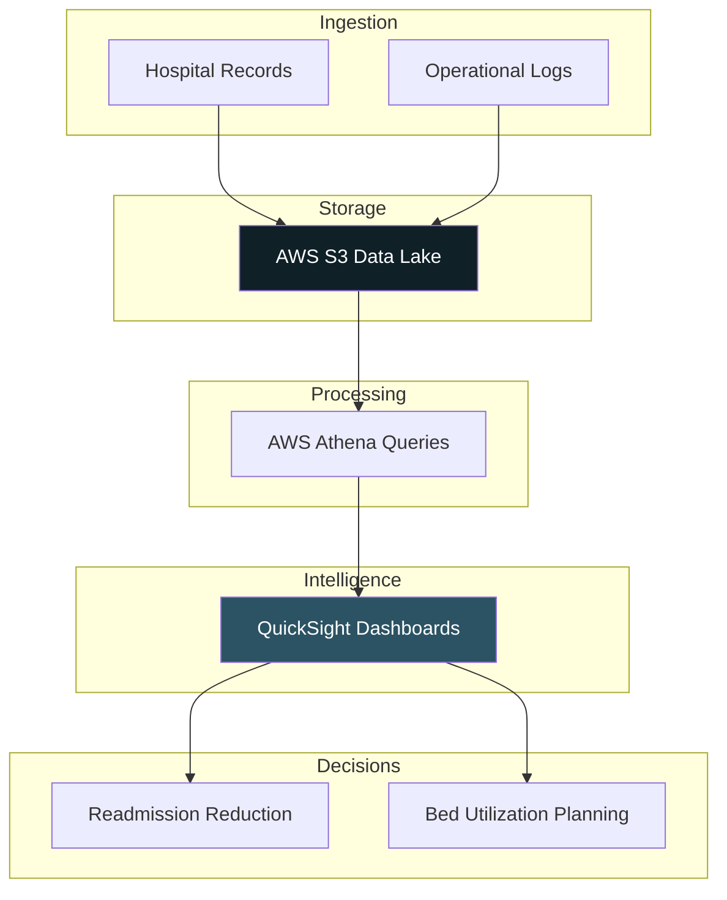

**📍 Raipur, India** · **B.Tech CSE (Data Science), Amity University** · **CGPA 7.45** · **2026 Graduate**

---

## 🎯 Professional Summary

I design and build production-style analytics systems that convert raw, messy data into decision-ready business intelligence — the kind of systems a data team ships to production, not classroom exercises.

Across internships and independent builds I've worked the full stack: ingesting and cleaning data, modeling risk and behavior, engineering BI layers, and deploying analytics as usable products — Streamlit apps, Power BI dashboards, and cloud-native pipelines that a business user can open and act on directly.

**Core focus areas:** Business Intelligence & Executive Dashboarding · Financial & Risk Analytics · Customer & Retail Analytics · Cloud-Native Analytics (AWS) · Big Data Engineering (PySpark) · Predictive Modeling & Forecasting

---

## 💼 Professional Experience

**Data Analytics Associate (L1) · Infotact Solutions**
*Feb 2026 – May 2026 · Remote*
- Owned dashboard delivery across retail, finance, healthcare, and logistics accounts — shipped 12+ Power BI dashboards anchoring weekly stakeholder reporting.
- Rebuilt the data prep workflow in Python/PySpark end-to-end, cutting prep time by 60%.
- Applied Monte Carlo simulation and RFM segmentation to model customer and demand risk, directly informing pricing and inventory decisions for two client accounts.
- Restructured query workflows around AWS Athena over S3, cutting ad-hoc turnaround on multi-million-row datasets from hours to under 5 minutes.

**Summer Trainee · BSNL Western Telecom Region**
*Jun 2025 – Aug 2025 · On-site, Raipur*
- Designed an OCR automation workflow (Tesseract + OpenCV) to extract OLT traffic and power metrics from PuTTY sessions and the BSNL Teevra portal, removing ~90% of manual data entry division-wide.
- Automated peak-load reporting, giving network engineers a 3x faster read on emerging overloads.

**Data Analysis Intern · Cognifyz Technologies**
*Jun 2025 – Jul 2025 · Remote*
- Cleaned and transformed 5+ business datasets in Pandas/NumPy, correcting data-quality issues that had skewed KPI calculations by up to 18%.
- Built Plotly dashboards adopted into the reporting team's regular workflow, cutting weekly report compilation from ~4 hours to under 30 minutes.

**Summer IT Intern · UltraTech Cement (Baikunth Cement Works)**
*Jun 2024 – Aug 2024 · On-site, Raipur*
- Supported IT infrastructure and system administration at a large-scale manufacturing plant.
- Assisted with server/network monitoring, troubleshooting, and user support alongside the enterprise IT team.

---

## 🚀 Featured Projects

<b>🛍️ Consumer360 — Customer Segmentation & Lifetime Value Engine</b>

 

| | |
|---|---|
| **Problem** | Retail teams lacked visibility into which customers actually drove revenue, leading to generic, un-targeted marketing spend. |
| **Solution** | End-to-end customer analytics pipeline with RFM segmentation, cohort analysis, market basket analysis, and CLV modeling on 50K+ transaction records. |
| **Tech Stack** | `Python` `SQL` `Power BI` |
| **Business Impact** | RFM segmentation identified the **top 20% of customers as the primary revenue drivers**, sharpening where retention effort goes; surfaced a **15% Month-3 cohort drop-off** to inform retention strategy. |
| **Repository** | [🔗 Consumer-360](https://github.com/Riddhis2226/Consumer-360) |

<b>💰 AlphaPulse — Financial Analytics & Risk Intelligence Platform</b>

 

| | |
|---|---|
| **Problem** | Retail investors and analysts need institutional-grade risk visibility without institutional-grade tooling. |
| **Solution** | Portfolio risk platform running **10,000+ Monte Carlo iterations** for Value-at-Risk estimation (historical + parametric), Expected Shortfall, and volatility tracking across a six-asset portfolio. |
| **Tech Stack** | `Python` `MongoDB` `yfinance` `Streamlit` `Plotly` |
| **Business Impact** | Back-tested risk toolkit showed a **12% reduction in simulated portfolio drawdown** under stress scenarios; automated market data ingestion removed manual data collection entirely. |
| **Repository** | [🔗 AlphaPulse-Portfolio-Risk-Monitor](https://github.com/Riddhis2226/AlphaPulse-Portfolio-Risk-Monitor) |

<b>🎓 EduVista — AI-Powered IoT Attendance System</b>

 

| | |
|---|---|
| **Problem** | Manual attendance tracking in institutions is slow, error-prone, and easy to proxy. |
| **Solution** | Facial recognition (Luxand API) combined with RFID hardware for dual-mode identity verification, plus live dashboards flagging anomalies like tailgating as they occur. |
| **Tech Stack** | `Python` `Luxand API` `RFID` `IoT` |
| **Business Impact** | Vendor-reported facial recognition accuracy up to **99.5%**; cut manual attendance recording by **85%**. |
| **Repository** | [🔗 Edu-Vista-Attendance](https://github.com/Riddhis2226/Edu-Vista-Attendance) · [🌐 Live Demo](https://edu-vista-attendance.lovable.app/) |

<b>🍽️ ZomatoLens — Restaurant Intelligence Platform</b>

 

| | |
|---|---|
| **Problem** | Restaurant trend data in India is fragmented across cuisines, cities, and price bands with no unified view. |
| **Solution** | Interactive intelligence platform combining NLP-based sentiment analysis with geospatial mapping of restaurant trends. |
| **Tech Stack** | `Python` `Streamlit` `Plotly` `NLP` |
| **Business Impact** | Turned unstructured reviews into a searchable sentiment + location intelligence layer for restaurant trend discovery. |
| **Repository** | [🔗 ZomatoLens](https://github.com/Riddhis2226/ZomatoLens-A-Data-Driven-Exploration-of-Restaurant-Trends-in-India) |

<b>💹 Financial Portfolio Optimization System</b>

 

| | |
|---|---|
| **Problem** | Manually balancing risk and return across assets is inefficient without quantitative tooling. |
| **Solution** | Efficient Frontier construction, Monte Carlo simulation, and Sharpe Ratio optimization for portfolio allocation. |
| **Tech Stack** | `Python` `SQLite` `Power BI` |
| **Business Impact** | Enabled data-driven allocation decisions grounded in risk-adjusted return rather than intuition. |
| **Repository** | [🔗 Financial-Portfolio-Optimization-System](https://github.com/Riddhis2226/Financial-Portfolio-Optimization-System) |

<b>⛽ Fuel Economy Analysis & Predictive Modeling</b>

 

| | |
|---|---|
| **Problem** | Understanding what drives vehicle fuel efficiency requires structured statistical exploration, not guesswork. |
| **Solution** | Full ML pipeline — EDA, clustering, classification, and regression — to model fuel economy drivers. |
| **Tech Stack** | `Python` `Scikit-Learn` |
| **Business Impact** | Produced a reusable predictive modeling framework applicable to efficiency and emissions analysis. |
| **Repository** | [🔗 Fuel-Economy-Analysis](https://github.com/Riddhis2226/Fuel-Ecomony-Analysis-and-Predictive-Modeling) |

---

## 🏗️ Enterprise Builds (In Progress)

<table>
<tr>
<td width="50%" valign="top">
<h3>🏥 MediFlow Cloud</h3>

<b>Patient Readmission & Hospital Resource Optimization</b>

<b>Stack:</b> AWS S3 · AWS Athena · SQL · PySpark · Power BI · QuickSight 
<b>Progress:</b> Serverless data lake cut retrieval latency from 45 minutes to under 90 seconds on a ~2TB simulated patient dataset; logistic regression has flagged 5 readmission-risk predictors feeding bed-occupancy and length-of-stay dashboards.

</td>
<td width="50%" valign="top">
<h3>🚚 LogiScale BigData</h3>

<b>Intelligent Supply Chain Analytics Platform</b>

<b>Stack:</b> PySpark · Spark SQL · Parquet · Gemini API · Streamlit · Plotly 
<b>Progress:</b> Distributed Spark SQL processing over the DataCo Supply Chain dataset; lazy-loading Export Center has cut first-run load time from ~38s to ~3.6s.

</td>
</tr>
</table>

---

## 🧬 Analytics Architecture

**General pipeline pattern used across projects:**

**Applied example — MediFlow Cloud:**

---

## 🛠️ Technology Stack

| Category | Technologies |
|:---|:---|
| **Programming** | Python · SQL · JavaScript |
| **Analytics** | Pandas · NumPy · SciPy · Scikit-Learn |
| **BI & Visualization** | Power BI · Tableau · Plotly · Matplotlib · Seaborn · Streamlit |
| **Databases** | MySQL · SQLite · MongoDB |
| **Cloud** | AWS S3 · AWS Athena · Amazon QuickSight |
| **Big Data** | PySpark · Spark SQL · Parquet |
| **AI & Automation** | OpenAI API · Gemini API · Claude API · Hugging Face · n8n · Zapier |

---

## 🎯 Current Mission

<table>
<tr>
<td width="33%" valign="top">
<h4>🔨 Currently Building</h4>
AlphaPulse-v2 — a refactored multipage Streamlit app with advanced risk analytics, portfolio optimization, predictive analytics, and a live market overview page.
</td>
<td width="33%" valign="top">
<h4>📚 Currently Learning</h4>
NISM certification track and deeper cloud-native BI architecture (AWS + Power BI at production scale).
</td>
<td width="33%" valign="top">
<h4>🔮 Future Focus</h4>
Bridging BI engineering with applied AI — Gemini/Claude-powered analytics copilots layered on enterprise data pipelines.
</td>
</tr>
</table>

---

## 📄 Resume

---

**"Data tells the story — I build the systems that make it legible to decision-makers."**

